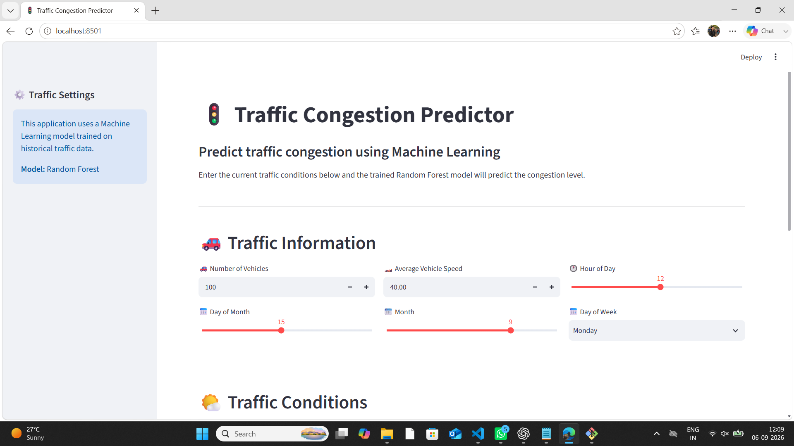

# 🚦 Traffic Congestion Predictor

A Machine Learning project that predicts traffic congestion levels using historical traffic data.

## 📌 Project Overview

Traffic congestion is a common problem in urban areas. This project uses Machine Learning to analyze traffic conditions and predict congestion levels based on factors such as:

* Number of vehicles
* Vehicle speed
* Hour of the day
* Day of the month
* Month
* Day of the week
* Weekend status
* Peak-hour status

The trained Machine Learning model is integrated with a Streamlit web application for interactive predictions.

## 🎯 Objective

The main objective of this project is to build an end-to-end Machine Learning system that can:

1. Load and analyze traffic data
2. Clean and prepare the dataset
3. Perform Exploratory Data Analysis (EDA)
4. Create useful features
5. Train Machine Learning models
6. Compare model performance
7. Save the trained model
8. Make traffic congestion predictions through a web application

## 🛠️ Technologies Used

* Python
* Pandas
* NumPy
* Matplotlib
* Seaborn
* Scikit-learn
* Joblib
* Streamlit

## 🤖 Machine Learning Models

The following classification algorithms were tested:

* Logistic Regression
* Decision Tree Classifier
* Random Forest Classifier

The models were evaluated using:

* Accuracy
* Precision
* Recall
* F1 Score
* Confusion Matrix

## 📂 Project Structure

```text
Traffic-Congestion-Predictor
│
├── Data
│   └── traffic_data.csv
│
├── Models
│   └── traffic_congestion_model.pkl
│
├── Notebooks
│
├── Src
│   ├── check_data.py
│   ├── eda.py
│   ├── feature_engineering.py
│   ├── prepare_data.py
│   ├── split_data.py
│   ├── train_models.py
│   ├── predict.py
│   ├── evaluate_models.py
│   └── save_model.py
│
├── images
│   ├── traffic-predictor-app.png (2).png
│   └── traffic-predictor-app.png.png
│
├── app.py
├── README.md
├── requirements.txt
└── .gitignore
```

## ⚙️ Installation

Clone the repository:

```bash
git clone https://github.com/Swetha603/Traffic-Congestion-Predictor.git
```

Move into the project folder:

```bash
cd Traffic-Congestion-Predictor
```

Install the required libraries:

```bash
pip install -r requirements.txt
```

## ▶️ Run the Application

Start the Streamlit application:

```bash
python -m streamlit run app.py
```

The application will open in your browser.

## 📊 Application Features

The Streamlit dashboard allows users to enter:

* Number of vehicles
* Average vehicle speed
* Hour
* Day
* Month
* Day of week
* Weekend status
* Peak-hour status

The trained Machine Learning model then predicts the traffic congestion level.

## 🖥️ Application Screenshots

### Traffic Congestion Predictor

.png)

### Prediction Interface



## 🔄 Machine Learning Workflow

```text
Traffic Dataset
       ↓
Data Cleaning
       ↓
Exploratory Data Analysis
       ↓
Feature Engineering
       ↓
Train/Test Split
       ↓
Model Training
       ↓
Model Evaluation
       ↓
Best Model
       ↓
Saved Model
       ↓
Streamlit Application
       ↓
Traffic Congestion Prediction
```

## 🚀 Future Improvements

* Add weather information
* Add road-condition information
* Add location-based predictions
* Use a larger traffic dataset
* Improve model accuracy
* Add interactive charts
* Add real-time traffic data
* Deploy the application online

## 👩‍💻 Author

**P. Sai Swetha**

B.Tech CSE Data Science Student

GitHub: [@Swetha603](https://github.com/Swetha603)
